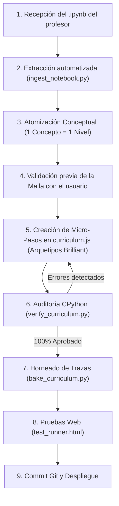

# 📚 Manual de Arquitectura de Niveles, Ingesta de Notebooks y Estándar Pedagógico Estilo Brilliant — pyMinas v1.0
Facultad de Minas · Universidad Nacional de Colombia - Sede Medellín

> **Principio Fundacional de pyMinas:**  
> *"En una plataforma educativa de ingeniería, un bug visual incomoda, pero **un ejercicio con una salida errónea, una explicación confusa o una opción ambigua destruye por completo la confianza y el proceso de aprendizaje del estudiante**."*  
> 
> Esta guía establece el **workflow oficial de ingesta de Jupyter Notebooks (.ipynb)** del profesor, la **descomposición en conceptos únicos e indivisibles (1 concepto = 1 nivel)** y el **estándar de micro-ejercicios estilo Brilliant** con verificación automatizada en CPython.

---

## 🧭 1. Filosofía Pedagógica: La Regla de los 15 Segundos

pyMinas adopta el modelo de **microaprendizaje táctil de alta densidad** inspirado directamente en **Brilliant** y **Duolingo**, adaptado al rigor del curso de *Fundamentos de Programación* de la Facultad de Minas:

1. **La Regla de los 15 Segundos:** Cada pantalla debe poder leerse, procesarse mentalmente y responderse en pocos segundos. Se prohíben terminantemente los bloques largos de texto o lecturas tipo diapositiva de clase.
2. **Un solo concepto único por nivel:** El notebook del profesor suele mezclar múltiples temas en una sola celda. En pyMinas, cada concepto atómico (ej. `operadores de comparación`, `if simple`, `else`, `elif`, `operadores lógicos`) se convierte en un **Nivel independiente en el mapa**.
3. **Predicción activa antes de la ejecución (`predict`):** El estudiante debe trazar mentalmente el flujo del programa antes de ver la salida. Trazar código mentalmente es la habilidad #1 que distingue a un ingeniero que programa.
4. **Retroalimentación diagnóstica inmediata (`whyIncorrect` y botón `¿Por qué?`):** Las opciones incorrectas son distractores pedagógicos que capturan fallas de razonamiento reales. Al fallar o acertar, el estudiante siempre tiene acceso a la justificación exacta.

---

## 🔄 2. Workflow Oficial: Del Jupyter Notebook (.ipynb) a pyMinas

Cuando el profesor entrega un cuaderno de Jupyter (`.ipynb`) con el contenido de la semana, el proceso de adaptación sigue este flujo de 5 etapas:



### Etapa 1: Ingesta Automatizada del Notebook
El notebook se procesa con la herramienta de extracción del repositorio:
```bash
python3 ingest_notebook.py ruta/al/notebook_del_profesor.ipynb
```
El script realiza:
* Lectura del JSON del notebook y extracción de celdas Markdown y de Código.
* Limpieza automática de comandos mágicos de Jupyter (`%matplotlib`, `!pip`, `!git`).
* Agrupamiento de fragmentos de código bajo sus encabezados temáticos.

### Etapa 2: Atomización Conceptual
Los notebooks universitarios suelen ser monolíticos (ej. un notebook de 60 celdas titulado *"Condicionales y Control de Flujo"*). **Nunca se crea un solo nivel gigante.** Se divide en conceptos atómicos:

| Tema Monolítico del Profesor | Descomposición en Niveles de pyMinas (1 Concepto = 1 Nivel) |
| :--- | :--- |
| **Condicionales** | **Nivel 1:** Booleanos y operadores de comparación (`>`, `<`, `==`, `!=`)<br>**Nivel 2:** El condicional simple `if` y la regla de indentación<br>**Nivel 3:** La bifurcación binaria con `else`<br>**Nivel 4:** Múltiples caminos excluyentes con `elif`<br>**Nivel 5:** Operadores lógicos compuestos (`and`, `or`, `not`)<br>**Nivel 6:** Detección de errores comunes y anidamiento |
| **Ciclos / Bucles** | **Nivel 1:** El ciclo condicional `while` y variables de control<br>**Nivel 2:** Evitar bucles infinitos y condiciones de parada<br>**Nivel 3:** El ciclo `for` con la función `range(n)`<br>**Nivel 4:** Variaciones de `range(inicio, fin, paso)`<br>**Nivel 5:** Control de flujo con `break` y `continue`<br>**Nivel 6:** Acumuladores y contadores en ciclos |

### Etapa 3: Validación Previa con el Usuario
Antes de redactar los ejercicios, el agente presenta al usuario la lista de niveles sugeridos:
> *"He analizado el notebook de la Semana X. Propongo dividir la temática en los siguientes 5 niveles atómicos: [Lista]. ¿Estás de acuerdo con esta estructura o deseas ajustar algún nivel?"*

### Etapa 4: Construcción de Micro-Pasos por Nivel
Cada nivel se compone de **4 a 6 micro-pasos** diseñados bajo los 4 arquetipos de Brilliant (ver Sección 3).

### Etapa 5: Pipeline de Auditoría, Horneado y Despliegue
```bash
# 1. Auditar con CPython real (salidas exactas, syntax, options)
python3 verify_curriculum.py

# 2. Hornear trazas de ejecución línea por línea
python3 bake_curriculum.py

# 3. Validar interfaz en modo headless
google-chrome --headless --virtual-time-budget=2000 --dump-dom "http://localhost:8080/test_runner.html" | grep "TODAS"

# 4. Git commit y push
git add curriculum.js baked_traces.js index.html
git commit -m "feat: add Semana X from notebook (v1.X)"
git push origin main
```

---

## 🎯 3. Los 4 Arquetipos de Ejercicios Estilo Brilliant

A partir de las referencias reales de la plataforma Brilliant (*Thinking in Python: Python Conditional Logic*), cada lección combina los siguientes 4 formatos de micro-retos:

```text
Estructura Canónica de un Nivel (4 a 6 pasos):
├─ Paso 1: Arquetipo 4 · Demostración Activa con Traza (explanation)
├─ Paso 2: Arquetipo 1 · Predicción de Salida Mental (predict)
├─ Paso 3: Arquetipo 2 · Detección de Errores / Spot the Bug (predict)
├─ Paso 4: Arquetipo 3 · Reparar o Completar Código (code_sandbox)
└─ Paso 5: Arquetipo 1/3 · Reto de Caso Borde o Práctica Guiada
```

---

### 🟢 Arquetipo 1: Predicción de Salida Mental (`predict`)
*Inspirado en la Captura de Referencia 1 de Brilliant.*

* **Pregunta directa:** `"¿Qué imprime este programa?"` o `"What does this program print?"`.
* **Código:** Bloque ultra-corto (3 a 5 líneas) con números de línea visibles.
* **Opciones:** 2 a 4 botones grandes con las salidas formateadas limpiamente (ej. `Locked? True` vs `Locked? False`).
* **Objetivo:** Obligar al estudiante a calcular en su cabeza el resultado de operadores o mutaciones simples en menos de 10 segundos.

```javascript
{
  type: "predict",
  partLabel: "Paso 2 · Trazado mental",
  title: "¿Qué imprime este programa?",
  question: "¿Cuál será la salida exacta tras evaluar la comparación en la última línea?",
  code: `username = "QuickFox"
failed_logins = 4

failed_logins += 1
print("Locked?", failed_logins >= 5)`,
  options: [
    {
      id: "A",
      text: "Locked? True",
      isCorrect: true
    },
    {
      id: "B",
      text: "Locked? False",
      isCorrect: false,
      whyIncorrect: "Inicialmente failed_logins es 4. Con '+=' suma 1 y pasa a 5. Como 5 >= 5 es verdadero, la salida es True."
    }
  ],
  correctionTip: "El operador '+=' incrementa el valor en memoria antes de evaluar la comparación '>='.",
  fullAnswerExplanation: "failed_logins pasa de 4 a 5. La condición '5 >= 5' evalúa a True, por lo que print() muestra 'Locked? True'."
}
```

---

### 🟡 Arquetipo 2: Detección de Errores / Spot the Bug (`predict`)
*Inspirado en la Captura de Referencia 2 de Brilliant.*

* **Pregunta diagnóstica:** `"¿Cuál es el error en este código?"` acompañado de la regla de negocio (ej. *"Las cuentas con 5 o más intentos fallidos deben bloquearse"*).
* **Código:** El código tiene un fallo conceptual común (ej. `< 5` en vez de `>= 5`, o `=` en vez de `==`).
* **Opciones:** Diagnósticos descriptivos que explican el síntoma o causa del problema.
* **Objetivo:** Desarrollar pensamiento crítico de depuración (debugging).

```javascript
{
  type: "predict",
  partLabel: "Paso 3 · Detección de errores",
  title: "¿Cuál es el error en este programa?",
  question: "Regla del sistema: Las cuentas con 5 o más intentos fallidos deben bloquearse. ¿Qué está fallando en el código?",
  code: `username = "QuickFox"
failed_logins = 1

failed_logins += 4
print("Locked?", failed_logins < 5)`,
  options: [
    {
      id: "A",
      text: "Bloquea las cuentas cuando hay menos de 5 intentos fallidos.",
      isCorrect: true
    },
    {
      id: "B",
      text: "Bloquea la cuenta cuando hay más de 5 intentos fallidos.",
      isCorrect: false,
      whyIncorrect: "El operador usado es '<' (menor que), lo que causa el efecto contrario: daría True solo para valores menores a 5."
    },
    {
      id: "C",
      text: "Genera un error de sintaxis en la suma.",
      isCorrect: false,
      whyIncorrect: "failed_logins += 4 es una sintaxis de incremento perfectamente válida en Python."
    }
  ],
  correctionTip: "Para representar '5 o más' se debe usar el operador mayor o igual (>=), no menor (<).",
  fullAnswerExplanation: "Al usar '< 5', la expresión evalúa a False cuando la cuenta acumula 5 intentos. El operador correcto es '>='."
}
```

---

### 🔵 Arquetipo 3: Reparar o Completar Código (`code_sandbox`)
*Inspirado en las Capturas de Referencia 3 y 5 de Brilliant.*

* **Instrucción concisa:** `"Corrige el programa"` o `"Completa el código"` con el objetivo específico.
* **Código interactivo:** Contiene un espacio en blanco marcado con `___`.
* **Opciones de reemplazo:** Botones interactivos que rellenan el código en tiempo real.
* **Ejecución inmediata:** Al presionar `Verificar` / `Enter`, el código corre en WebAssembly/CPython y la consola `OUTPUT` muestra el resultado real.
* **Botón `¿Por qué?`:** Tras acertar, el estudiante puede consultar la explicación profunda antes de continuar.

```javascript
{
  type: "code_sandbox",
  partLabel: "Paso 4 · Práctica interactiva",
  title: "Corrige el bloque de bloqueo de cuenta",
  instruction: "El sistema debe bloquear la cuenta si failed_logins alcanza 5 o más. Completa la expresión adecuada:",
  starterCode: `username = "QuickFox"
failed_logins = 1

failed_logins += 4
print("Locked?", ___)`,
  slotMarker: "___",
  options: [
    {
      id: "A",
      code: "failed_logins >= 5",
      label: "failed_logins >= 5",
      isCorrect: true,
      feedback: "¡Excelente! '>= 5' bloquea exactamente a partir de 5 intentos o más."
    },
    {
      id: "B",
      code: "failed_logins > 5",
      label: "failed_logins > 5",
      isCorrect: false,
      feedback: "Con '> 5', un usuario con exactamente 5 intentos no sería bloqueado; requeriría 6."
    },
    {
      id: "C",
      code: "failed_logins == 5",
      label: "failed_logins == 5",
      isCorrect: false,
      feedback: "Con '== 5', si alguien acumula 6 o más intentos, la condición daría False y la cuenta se desbloquearía."
    }
  ]
}
```

---

### 🟣 Arquetipo 4: Demostración Activa con Traza Paso a Paso (`explanation`)
*Inspirado en la Captura de Referencia 4 de Brilliant.*

* **Foco visual:** Snippet corto (3 a 6 líneas) con consola de salida conectada.
* **Interactividad:** Botón de reproducción línea por línea con indicador `▶` sobre la línea activa y actualización sincronizada del terminal.
* **Texto mínimo:** Máximo 2 oraciones introduciendo el mecanismo.

```javascript
{
  type: "explanation",
  partLabel: "Paso 1 · Observa la ejecución",
  title: "¿Cómo toma decisiones un condicional if?",
  intro: "La instrucción <code>if</code> evalúa una condición lógica. Si es verdadera, ejecuta el bloque indentado; si es falsa, lo salta por completo.",
  examples: [
    {
      label: "Alerta de seguridad",
      code: `username = "MagnumKPI"
failed_logins = 4

if failed_logins > 3:
    print("⚠️ Warning!")
print("Intentos registrados:", failed_logins)`,
      output: "⚠️ Warning!\nIntentos registrados: 4",
      explanation: "Como 4 > 3 es True, Python entra al bloque indentado y muestra la advertencia antes de continuar."
    }
  ],
  keyTakeaway: "En Python, la indentación (4 espacios) define qué líneas pertenecen al bloque condicional."
}
```

---

## 📏 4. Reglas de Oro de Diseño Pedagógico

| Métrica | Límite Estricto | Razón Pedagógica |
| :--- | :--- | :--- |
| **Líneas de código por snippet** | **Máximo 4 a 7 líneas** | Evita la sobrecarga cognitiva; cabe completo en pantalla de celular y laptop sin scroll. |
| **Texto de instrucción / enunciado** | **Máximo 2 a 3 oraciones** | En Brilliant, el enunciado se lee en 3 segundos. El foco está en el código. |
| **Opciones en `predict`** | **2 a 4 opciones** | Suficientes para capturar errores típicos sin generar fatiga de decisión. |
| **Calidad de `whyIncorrect`** | **Mínimo 20 caracteres diagnósticos** | Prohibido decir *"Opción incorrecta"*. Debe explicar qué pensó mal el alumno. |
| **Ubicación de la consola** | **Debajo del editor** | Réplica exacta de cómo lucen los IDEs profesionales (VS Code, Jupyter, PyCharm). |
| **Puntualidad en `output`** | **100% idéntico a CPython** | Verificado automáticamente por `verify_curriculum.py` carácter por carácter. |

---

## 🛡️ 5. Protocolo de Verificación y Validación Automática

Para evitar bugs en producción, toda nueva lección debe superar el pipeline automático:

```bash
# 1. Auditoría automática del currículo (salida, sintaxis, IDs)
python3 verify_curriculum.py

# 2. Generación de trazas de ejecución pre-horneadas
python3 bake_curriculum.py

# 3. Verificación de tests de navegación y racha
google-chrome --headless --virtual-time-budget=2000 --dump-dom "http://localhost:8080/test_runner.html" | grep "TODAS"
```

El script [`verify_curriculum.py`](file:///verify_curriculum.py) ejecuta cada fragmento con el motor CPython del sistema, comprobando que:
* No existan IDs duplicados.
* La propiedad `output` de los `explanation` sea exacta (espacios, saltos de línea, mayúsculas).
* Cada opción de `code_sandbox` genere código sintácticamente ejecutable.
* Todas las preguntas `predict` tengan exactamente una respuesta correcta y explicaciones en todas las falsas.

---

## 📋 6. Checklist de Aprobación para Nuevos Niveles

Antes de dar por finalizada la creación de un nivel:
- [ ] ¿Se extrajo la temática a partir del `.ipynb` usando `ingest_notebook.py`?
- [ ] ¿El nivel enseña un **único concepto atómico** y no una mezcla de temas?
- [ ] ¿Cada pantalla se puede resolver en aproximadamente **15 segundos**?
- [ ] ¿Los snippets de código tienen entre **3 y 6 líneas**?
- [ ] ¿Cada opción falsa en `predict` tiene un `whyIncorrect` diagnóstico claro?
- [ ] ¿Los ejercicios `code_sandbox` usan el marcador `___` y compilan en CPython?
- [ ] ¿Ejecutaste `python3 verify_curriculum.py` con **0 errores**?
- [ ] ¿Ejecutaste `python3 bake_curriculum.py` para sincronizar `baked_traces.js`?
- [ ] ¿Probaste `test_runner.html` en el navegador?
- [ ] ¿Incrementaste el número de versión de caché en `index.html`?
