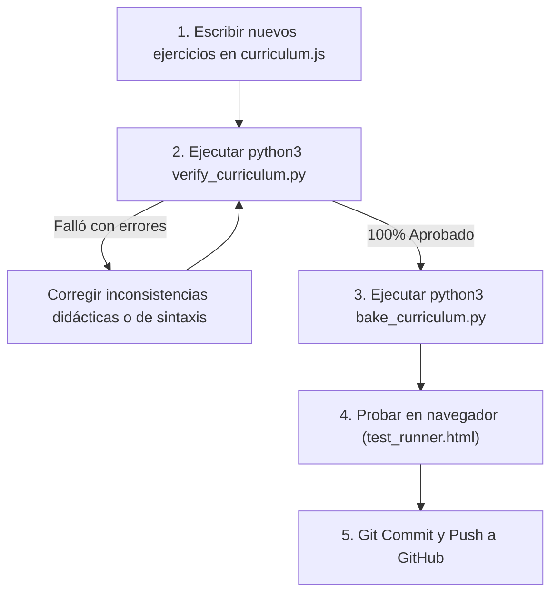

# 📚 Manual de Creación y Verificación Rigurosa de Ejercicios — pyMinas v1.0

> **Principio Fundacional de pyMinas:**  
> *"En una plataforma educativa de ingeniería, un bug visual en la interfaz incomoda, pero **un ejercicio con una salida errónea, una explicación confusa o una opción ambigua destruye por completo el proceso de aprendizaje**."*  
> 
> Esta guía establece la arquitectura, estándares pedagógicos y el **protocolo automatizado de verificación en 3 niveles** para garantizar cero errores en el currículo interactivo.

---

## 🧭 1. Filosofía Pedagógica

pyMinas está diseñado bajo el modelo de **micro-retos interactivos** inspirado en Brilliant y Duolingo, adaptado para estudiantes de **Fundamentos de Programación** de la Facultad de Minas (UNAL Medellín):

1. **Un solo concepto por pantalla:** Nunca abrumes al estudiante con bloques largos de teoría. Cada paso debe enseñar o reforzar una única idea clave.
2. **Intuición antes que sintaxis:** Primero presenta la lógica cotidiana o el modelo mental (ej. *"una receta con un orden estricto"*), luego muestra el código en Python.
3. **Predicción activa (`predict`):** Obliga al estudiante a pensar antes de ver el resultado. Leer código y predecir su efecto construye la habilidad más importante de un programador: el *trazado mental*.
4. **Retroalimentación diagnóstica (`whyIncorrect`):** Las opciones incorrectas no son "trampas": son **distractores pedagógicos**. Cada una debe anticipar un error de razonamiento común y explicar exactamente por qué es erróneo.

---

## 🏗️ 2. Jerarquía del Currículo (`curriculum.js`)

Todo el contenido académico reside en [`curriculum.js`](file:///curriculum.js). La estructura jerárquica es:

```text
CURRICULUM
└── weeks (Semanas del semestre)
    └── lessons (Lecciones por semana)
        └── steps (6 pasos pedagógicos por lección)
```

### Estructura canónica de una lección (6 pasos recomendados):
1. **Paso 1 (`explanation`):** Introducción al concepto fundamental con un ejemplo de código breve y su reproductor interactivo.
2. **Paso 2 (`predict`):** Pregunta conceptual de opción múltiple para evaluar la intuición básica.
3. **Paso 3 (`explanation`):** Profundización o caso especial del concepto (ej. operadores avanzados, parámetros `sep`/`end`, etc.).
4. **Paso 4 (`predict`):** Reto de lectura de código: ¿cuál es la salida exacta o el comportamiento del fragmento?
5. **Paso 5 (`predict` o `visualizer_*`):** Laboratorio táctil o ejercicio de análisis de errores comunes.
6. **Paso 6 (`code_sandbox`):** Práctica guiada donde el estudiante completa un espacio en blanco (`___`) y ejecuta el código en vivo.

---

## 🧩 3. Tipos de Pasos y Plantillas

### Tipo A: Explicación Interactiva (`explanation`)
Muestra una breve teoría, un fragmento de código con reproductor línea a línea y una conclusión para recordar.

```javascript
{
  type: "explanation",
  partLabel: "Paso 1 · El concepto",
  title: "¿Qué es una variable en memoria?",
  intro: "Una <strong>variable</strong> es como una caja con nombre donde guardas un dato para usarlo más adelante en tu programa.",
  examples: [
    {
      label: "Guardando y mostrando datos",
      code: `# Guardamos valores en memoria:
nombre = "Lucía"
edad = 20

# Los mostramos en pantalla:
print("Nombre:", nombre)
print("Edad:", edad)`,
      output: "Nombre: Lucía\nEdad: 20",
      explanation: "El signo = no compara igualdad: asigna el valor de la derecha dentro de la caja de la izquierda."
    }
  ],
  keyTakeaway: "En Python no necesitas declarar el tipo de variable: el intérprete lo deduce automáticamente según el valor asignado."
}
```

> **⚠️ REGLA DE ORO DE `output`:**  
> La propiedad `output` debe coincidir **carácter por carácter** con la salida real producida por CPython (respetando espacios, saltos de línea y mayúsculas). El auditor automático [`verify_curriculum.py`](file:///verify_curriculum.py) verificará esto en vivo.

---

### Tipo B: Predicción de Opción Múltiple (`predict`)
Presenta un reto donde el estudiante debe elegir entre opciones mutuamente excluyentes.

```javascript
{
  type: "predict",
  partLabel: "Paso 4 · Orden de operaciones",
  title: "¿Cuál es el resultado de este cálculo?",
  question: "¿Qué valor exacto imprimirá Python en pantalla al ejecutar esta línea?",
  code: `resultado = 2 + 3 * 4
print(resultado)`,
  options: [
    { 
      id: "A", 
      text: "14", 
      isCorrect: true 
    },
    { 
      id: "B", 
      text: "20", 
      isCorrect: false,
      whyIncorrect: "Si sumas primero 2 + 3 obtendrías 5, y 5 * 4 = 20. Pero Python sigue la jerarquía matemática (PEMDAS): la multiplicación siempre se calcula antes que la suma."
    },
    { 
      id: "C", 
      text: "\"14\"", 
      isCorrect: false,
      whyIncorrect: "El resultado es un número entero (int), no una cadena de texto (str). No lleva comillas."
    },
    { 
      id: "D", 
      text: "Error de sintaxis", 
      isCorrect: false,
      whyIncorrect: "En Python puedes combinar múltiples operaciones matemáticas en una sola línea sin ningún problema de sintaxis."
    }
  ],
  correctionTip: "Recuerda la jerarquía matemática estándar: la multiplicación (*) y división (/) tienen prioridad sobre la suma (+) y resta (-).",
  fullAnswerExplanation: "Siguiendo PEMDAS, Python primero resuelve 3 * 4 = 12, y luego suma 2 + 12 = 14. Si quisieras que sumara primero, tendrías que usar paréntesis: (2 + 3) * 4."
}
```

> **⚠️ REGLAS OBLIGATORIAS PARA `predict`:**
> 1. **Exactamente una opción correcta:** Una sola opción debe tener `isCorrect: true`. Las demás deben tener `isCorrect: false`.
> 2. **`whyIncorrect` es obligatorio y diagnóstico:** Toda opción falsa debe tener una explicación pedagógica de al menos 15 caracteres. Prohibido escribir frases vacías como *"Opción incorrecta"* o *"Esa no es la respuesta"*.
> 3. **IDs estandarizados:** Usa siempre letras mayúsculas consecutivas (`"A"`, `"B"`, `"C"`, `"D"`).

---

### Tipo C: Práctica Guiada en Vivo (`code_sandbox`)
Reto de rellenar el espacio en blanco marcado con `___`. Al seleccionar la opción, el estudiante ve cómo se completa el código en tiempo real y puede presionar `Enter` para compilarlo con WebAssembly (Pyodide).

```javascript
{
  type: "code_sandbox",
  partLabel: "Paso 6 · Práctica guiada",
  title: "Crea un ticket de compra con E-P-S",
  instruction: "Completa la etapa de Procesamiento sumando las variables de los productos para calcular el total a pagar.",
  starterCode: `# 1. ENTRADA (Datos iniciales):
producto_a = 45
producto_b = 30

# 2. PROCESAMIENTO (Suma los dos productos):
total = ___

# 3. SALIDA (Muestra el ticket):
print("Producto 1: $", producto_a, sep="")
print("Producto 2: $", producto_b, sep="")
print("Total a pagar: $", total, sep="")`,
  slotMarker: "___",
  options: [
    {
      id: "A",
      code: "producto_a + producto_b",
      label: "producto_a + producto_b",
      isCorrect: true,
      feedback: "¡Perfecto! Sumas las dos variables numéricas para obtener el total exacto ($75)."
    },
    {
      id: "B",
      code: '"producto_a" + "producto_b"',
      label: '"producto_a" + "producto_b"',
      isCorrect: false,
      feedback: "Al poner comillas, Python une los nombres como texto y daría 'producto_aproducto_b' en lugar de sumar los números."
    },
    {
      id: "C",
      code: "producto_a * producto_b",
      label: "producto_a * producto_b",
      isCorrect: false,
      feedback: "El operador * multiplica. Para un ticket de compra queremos el costo total acumulado con suma (+)."
    }
  ]
}
```

> **⚠️ REGLAS OBLIGATORIAS PARA `code_sandbox`:**
> 1. `starterCode` debe contener textualmente el marcador de espacio (por defecto `___`).
> 2. Al sustituir `___` por la opción correcta (`code`), el código resultante debe ser **sintácticamente válido y ejecutable en CPython**.
> 3. Cada opción debe incluir retroalimentación inmediata (`feedback`).

---

## 🛡️ 4. Protocolo Obligatorio de Verificación Exhaustiva

Para garantizar que ningún error pedagógico o técnico llegue a los estudiantes, **antes de hacer commit de nuevos ejercicios debes seguir este flujo estricto**:



### Paso 1: Ejecutar el Auditor Pedagógico Automático
En la raíz del proyecto, ejecuta:
```bash
python3 verify_curriculum.py
```
El auditor realiza más de **360 comprobaciones automáticas** con el intérprete real de Python:
- Verifica que no haya IDs duplicados en semanas, lecciones u opciones.
- Ejecuta cada bloque de código en un sandbox aislado de CPython.
- Compara que `output` coincida al 100% con la salida real de Python.
- Valida que todas las preguntas `predict` tengan exactamente una respuesta correcta y explicaciones detalladas para cada error.
- Verifica que el código de los sandbox compile limpiamente al rellenar el espacio.

> Si el auditor encuentra algún fallo, detendrá el proceso con código de salida `1` e imprimirá la ubicación exacta del paso y la discrepancia encontrada.

---

### Paso 2: Hornear las Trazas de Reproducción Paso a Paso
Una vez que el auditor confirme que el currículo está limpio, genera las trazas de ejecución interactiva:
```bash
python3 bake_curriculum.py
```
Este script recorre todos los bloques de código y hornea su traza línea por línea en [`baked_traces.js`](file:///baked_traces.js). De esta manera, el estudiante puede usar las teclas `◀` y `▶` para ver cómo se ejecuta cada línea sin depender de llamadas de red.

---

### Paso 3: Probar la Suite de Regresión en el Navegador
Abre en tu navegador la suite de pruebas automatizada:
```text
http://localhost:8080/test_runner.html
```
O ejecútala en modo headless desde la terminal:
```bash
google-chrome --headless --dump-dom "http://localhost:8080/test_runner.html" | grep "TODAS"
```
Debe confirmar:
`✓ ¡TODAS LAS PRUEBAS DE FASE 1 PASARON CON ÉXITO!`

---

## 💡 5. Errores Comunes a Evitar

| Error Común | Por qué es peligroso | Cómo se resuelve |
| :--- | :--- | :--- |
| **Comillas dobles anidadas** | Escribir `print("Texto \"40\"")` dentro de plantillas JavaScript puede causar problemas al parsear. | Usa comillas simples afuera y dobles adentro: `print('Texto "40"')`. |
| **Salida manual desfasada** | Escribir en `output` lo que crees que imprime en vez de lo que CPython imprime realmente (ej: olvidar el espacio por defecto de `print(a, b)`). | Confía en `verify_curriculum.py`: el auditor compara contra la ejecución real de CPython. |
| **Parámetro `end=" "` en múltiples líneas** | Tratar cada llamada a `print` como un salto forzado de renglón. | Recuerda que `end=" "` mantiene la siguiente salida en la **misma línea**. |
| **Opciones sin justificación de error** | Dejar a un estudiante confundido tras fallar una pregunta. | Redacta siempre en `whyIncorrect` qué razonamiento erróneo llevó a escoger esa opción. |

---

## 🚀 6. Checklist de Aprobación para Nuevos Ejercicios

Antes de crear un Pull Request o subir a producción:

- [ ] ¿Cada lección nueva tiene entre 5 y 6 pasos?
- [ ] ¿El primer paso introduce la intuición antes de la sintaxis abstracta?
- [ ] ¿Todos los `predict` tienen exactamente 1 opción con `isCorrect: true`?
- [ ] ¿Cada opción falsa tiene un `whyIncorrect` pedagógico de calidad?
- [ ] ¿Los ejercicios `code_sandbox` tienen el marcador `___` en `starterCode`?
- [ ] ¿Ejecutaste `python3 verify_curriculum.py` y obtuviste **363+ verificaciones aprobadas y 0 errores**?
- [ ] ¿Ejecutaste `python3 bake_curriculum.py` para actualizar `baked_traces.js`?
- [ ] ¿Incrementaste la versión de caché (`?v=1.0.X`) en `index.html`?
