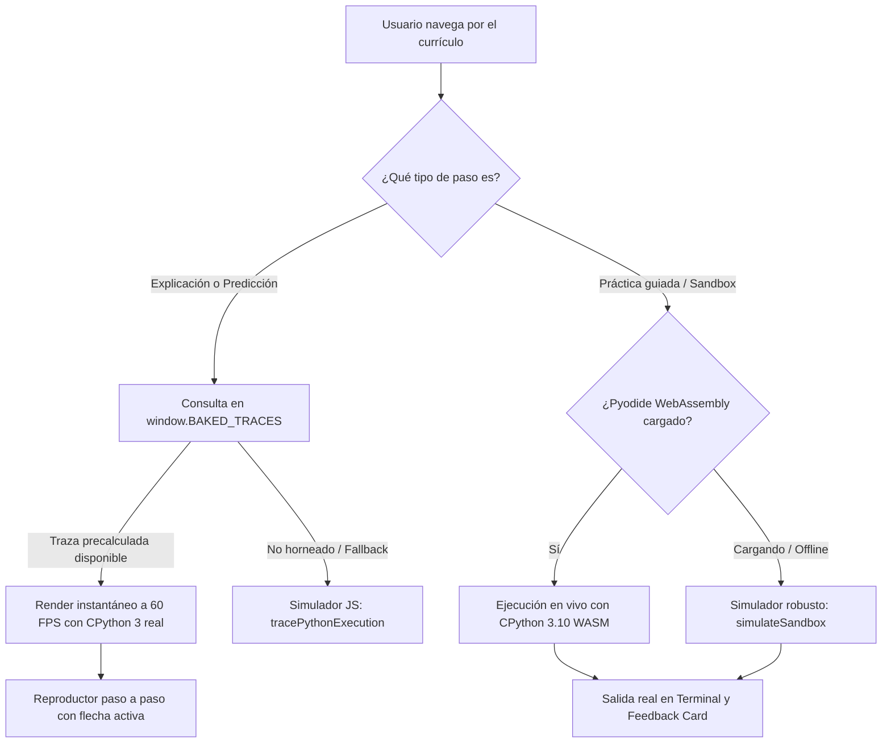

# Manual de Arquitectura, Diseño de Interacción y Creación de Módulos
## pyMinas — Fundamentos de Programación (Facultad de Minas · UNAL)

Este documento es la **guía maestra de referencia técnica y pedagógica** del proyecto. Describe la arquitectura del software, los principios de diseño de interfaz y experiencia de usuario (UI/UX), los esquemas de datos del currículo y las directrices exactas para diseñar e implementar futuros módulos (ej. Semana 2: Condicionales, Semana 3: Bucles, etc.).

---

## Tabla de Contenidos
1. [Visión del Producto y Filosofía Pedagógica](#1-visión-del-producto-y-filosofía-pedagógica)
2. [Reglas Sagradas de Experiencia de Usuario (UI/UX)](#2-reglas-sagradas-de-experiencia-de-usuario-uiux)
3. [Arquitectura del Sistema y Motor de Ejecución Híbrido](#3-arquitectura-del-sistema-y-motor-de-ejecución-híbrido)
4. [Jerarquía y Taxonomía de Contenidos](#4-jerarquía-y-taxonomía-de-contenidos)
5. [El Arco Pedagógico de una Lección (Estructura de 6 Pasos)](#5-el-arco-pedagógico-de-una-lección-estructura-de-6-pasos)
6. [Catálogo de Tipos de Pasos (Step Types y Esquemas JSON)](#6-catálogo-de-tipos-de-pasos-step-types-y-esquemas-json)
7. [Sistema de Diseño Visual y Paleta de Sintaxis VS Code](#7-sistema-de-diseño-visual-y-paleta-de-sintaxis-vs-code)
8. [Pipeline de Horneado con Python Real (`bake_curriculum.py`)](#8-pipeline-de-horneado-con-python-real-bake_curriculumpy)
9. [Plantilla Maestra Copy-Paste para Nuevas Lecciones](#9-plantilla-maestra-copy-paste-para-nuevas-lecciones)
10. [Checklist de Calidad y Troubleshooting](#10-checklist-de-calidad-y-troubleshooting)

---

## 1. Visión del Producto y Filosofía Pedagógica

La plataforma está diseñada para transformar el aprendizaje de programación desde un enfoque pasivo (leer diapositivas o ver videos) hacia un **entorno activo de microaprendizaje táctil**, combinando la profundidad conceptual de **Brilliant** con la gratificación inmediata y estructura de hábitos de **Duolingo**.

### Principios Fundamentales:
* **Aprender haciendo (Active Recall):** En lugar de largas explicaciones, los conceptos se introducen mediante fragmentos de código ejecutables de 4 a 8 líneas.
* **Predicción antes de la ejecución:** Forzar al estudiante a proyectar mentalmente qué hará la computadora antes de mostrarle el resultado.
* **Cero frustración por sintaxis al inicio:** Las primeras prácticas guían la sintaxis mediante recuadros interactivos y opciones múltiples antes de exigir escritura libre desde cero.
* **Entorno profesional desde el día uno:** La interfaz de código no parece un juguete; utiliza la paleta oficial de **VS Code Dark+**, números de línea reales y salida de terminal auténtica de Python 3.

---

## 2. Reglas Sagradas de Experiencia de Usuario (UI/UX)

A lo largo del desarrollo se han establecido reglas estrictas de UX que deben preservarse en cualquier modificación o módulo futuro:

### Regla 1: Diseño Single-Screen / No-Scroll
* Cada paso debe ser visible y ejecutable en una pantalla de laptop estándar (1280x800 o superior) sin necesidad de hacer scroll vertical para entender el ejercicio o pulsar el botón principal.
* **Los bloques de código nunca deben tener barra de desplazamiento vertical.** El alto del contenedor se adapta al número exacto de líneas del snippet.

### Regla 2: Reposicionamiento Automático al Cambiar de Paso (`scrollToLessonTop`)
* Al pulsar «Continuar» o navegar entre pasos, la ventana y el contenedor de la lección siempre se desplazan suave e instantáneamente a la parte superior (`y = 0`).
* **Motivo:** Evita que el usuario quede anclado al fondo de la pantalla y se pierda el título, la instrucción o la explicación del nuevo paso.

### Regla 3: Salida de Terminal Pura y Real
* La terminal muestra **únicamente** lo que la función `print()` de Python produce en `sys.stdout`.
* **Prohibido:**
  - Imprimir comentarios (`# ...`).
  - Mostrar comillas envolventes alrededor de strings impresos (ej. debe ser `Lucía`, nunca `"Lucía"`).
  - Dejar la terminal vacía tras una ejecución interactiva. Si un ejemplo se ofrece para ejecutar, **siempre debe incluir al menos una llamada a `print()`**.

### Regla 4: Bloqueo de Continuación hasta Interactuar
* El botón de avanzar permanece deshabilitado (gris claro, no clickeable) hasta que el estudiante interactúa con el reto de la pantalla:
  - En **explicaciones:** hasta que ejecute el código paso a paso o completo.
  - En **predicciones:** hasta que seleccione una respuesta y el código termine de ejecutarse.
  - En **prácticas guiadas:** hasta que elija una opción y ejecute el código con éxito.

### Regla 5: Retos de Análisis con Retroalimentación Diferida
* En preguntas donde el usuario debe pensar la salida de un código:
  1. Los botones de control del reproductor de código quedan bloqueados con el mensaje: *"Modo análisis: responde abajo para ejecutar"*.
  2. Al pulsar una opción, el código comienza a ejecutarse automáticamente línea por línea.
  3. **Solo cuando la animación llega a la última línea** se evalúa la respuesta, se lanza el confeti (si fue correcto), suena el audio y se revela la explicación.

### Regla 6: Reforzamiento Positivo y Exploración Libre Post-Aprobación
* Si el estudiante acierta:
  - Se le confirma de inmediato con un mensaje positivo conciso y un botón para *"Ver por qué"*.
  - La lección queda aprobada y el botón principal cambia a `Finalizar lección ➔` o `Continuar ➔`.
  - **Aun con la lección aprobada, se le permite pulsar las otras opciones** para explorar por qué eran incorrectas, sin perder la aprobación ni el botón de avanzar.

### Regla 7: Práctica Guiada con Recuadro de Inserción (`[ ___ ]`)
* El código de la práctica final nunca viene resuelto. Contiene un recuadro interactivo (`.code-slot-box`) con borde punteado celeste y cursor parpadeante (`blinking-cursor`).
* Debajo se ofrecen pastillas de código múltiples. Al seleccionar una, el recuadro se rellena con animación emergente (`animate-modal-pop`) y sintaxis resaltada a color, activando el botón `▶ Ejecutar código`.

### Regla 8: Atajos de Teclado Universales (Power Users & Accesibilidad)
Para una experiencia fluida sin depender del ratón:
* **Teclas `1`, `2`, `3`, `4`:** Seleccionan directamente las opciones de respuesta `A`, `B`, `C` o `D` en pasos de predicción y prácticas guiadas con slots.
* **Tecla `Enter` o `Espacio`:** Dispara inteligentemente la acción primaria según el estado del paso:
  - En predicción: Comprobar (si está habilitado) o Continuar ➔ (si ya fue aprobada).
  - En práctica guiada: ▶ Ejecutar código (si se eligió opción) o Finalizar lección ➔ (si ya fue completada).
  - En modales de inicio/victoria: Acepta y avanza de pantalla.
* **Teclas `ArrowLeft` / `ArrowRight`:** Avanzan o retroceden línea a línea en el reproductor de código interactivo.
* **Tecla `Escape`:** Cierra modales o regresa de forma segura al mapa de lecciones (`backToDashboard`).
* **Guarda de seguridad estricta:** Todos los atajos se desactivan automáticamente cuando el foco está dentro de un `<textarea>` o `<input>`, garantizando que el usuario pueda escribir código libremente sin colisiones.

### Regla 9: Navegación Bidireccional de Pasos (`←`) y Persistencia Fina (`localStorage`)
* **Botón de retroceso en cabecera (`#lesson-prev-step-btn`):** Visible a partir del Paso 2 (`currentStepIndex > 0`), permitiendo al alumno repasar explicaciones y conceptos previos sin abandonar la lección ni perder su progreso.
* **Persistencia granular por paso (`py101_lesson_steps`):** El índice del paso actual se sincroniza automáticamente en `localStorage` bajo `{ [lessonId]: stepIndex }`. Si el estudiante cierra el navegador o refresca la pestaña, al reabrir la lección el sistema lo sitúa en el paso exacto en el que quedó. Al completar la lección con victoria, el paso guardado se reinicia limpiamente a 0 para futuros repasos.

### Regla 10: Unificación Estética de Terminal Retro (Brilliant Look & Feel)
Tanto la consola del reproductor de código (`codePlayer`) como la terminal integrada del sandbox (`renderSandboxStep`) comparten exactamente la misma identidad visual:
* Fondo negro absoluto `#000000`.
* Borde superior o contenedor esmeralda `#10b981`.
* Tipografía monoespaciada en verde brillante `#34d399` (`font-mono font-semibold`).
* Indicador de estado con pulso animado (`w-2 h-2 rounded-full bg-emerald-400 animate-ping` en reposo y éxito; `bg-amber-400` procesando; `bg-rose-400` en error).
* Encabezado en mayúsculas: `SALIDA EN PANTALLA (TERMINAL)`.

---

## 3. Arquitectura del Sistema y Motor de Ejecución Híbrido

La aplicación combina tres capas de ejecución para lograr la máxima velocidad, fiabilidad total y capacidades de sandbox:



### Estructura de Archivos del Proyecto
* **`index.html`:** Contenedor principal de la SPA. Define el layout responsive, importa fuentes (Plus Jakarta Sans, JetBrains Mono), estilos de botones 3D y componentes visuales.
* **`curriculum.js`:** Definición estática y declarativa de las semanas, lecciones y pasos.
* **`app.js`:** Núcleo de la aplicación:
  - Controlador de estado (`currentLesson`, `currentStepIndex`, `completedLessons`, `xp`, `streak`).
  - Resaltador de sintaxis Python VS Code Dark+ en una sola pasada (`highlightPythonSyntax`).
  - Motor de ejecución y reproducción de trazas (`codePlayerRegistry`).
  - Renderizadores especializados por cada `step.type`.
* **`baked_traces.js`:** Archivo autogenerado que contiene las trazas de ejecución de cada fragmento de código, extraídas directamente de CPython 3.
* **`bake_curriculum.py`:** Script en Python que analiza `curriculum.js` con el módulo `ast`, ejecuta cada bloque sentencia por sentencia y produce `baked_traces.js`.
* **`server.py`:** Servidor HTTP ligero en Python con encabezados anti-caché para desarrollo ágil.

---

## 4. Jerarquía y Taxonomía de Contenidos

El currículo se estructura en tres niveles estrictos:

```
CURRICULUM
 └── Semanas (weeks: Array)
      └── Lecciones (lessons: Array)
           └── Pasos (steps: Array)
```

### Convención de Identificadores (IDs):
* **Semanas:** `semana-{N}` (ej. `semana-1`, `semana-2`, `semana-3`).
* **Lecciones:** `w{Semana}-l{Lección}` (ej. `w1-l1`, `w1-l2`, `w2-l1`).
* **Etiquetas de Pasos (`partLabel`):** Formato `Paso {N} · {Nombre corto}` (ej. `Paso 1 · Variables y Tipos`).

---

## 5. El Arco Pedagógico de una Lección (Estructura de 6 Pasos)

Cada lección estándar debe seguir una secuencia pedagógica de 6 pasos para garantizar el ritmo de aprendizaje:

| Paso | Tipo (`type`) | Objetivo Pedagógico | Interacción Principal |
| :--- | :--- | :--- | :--- |
| **1** | `explanation` | Introducir el concepto clave con código mínimo y legible. | Reproductor paso a paso con terminal activa. |
| **2** | `predict` | Evaluar la comprensión inmediata antes de avanzar. | Selección de salida esperada con animación de código. |
| **3** | `explanation` | Profundizar en un caso particular, regla de precedencia o función secundaria. | Reproductor paso a paso con comparativas (ej. con y sin paréntesis). |
| **4** | `predict` | Desafío de análisis con un caso práctico de la vida real. | Pregunta de opción múltiple con explicación detallada de cada fallo. |
| **5** | `visualizer_*` | Manipular parámetros en tiempo real para asimilar el concepto sin escribir código. | Controles interactivos tipo laboratorio (sliders, toggles, botones). |
| **6** | `code_sandbox` | Práctica guiada donde el alumno integra lo aprendido. | Editor VS Code con recuadro `[ ___ ]` y pastillas de opciones. |

---

## 6. Catálogo de Tipos de Pasos (Step Types y Esquemas JSON)

### 6.1. Paso Explicativo (`explanation`)
Introduce teoría con fragmentos ejecutables. **Regla de oro:** El código debe tener llamadas a `print()` descriptivas.

```javascript
{
  type: "explanation",
  partLabel: "Paso 1 · Los 4 tipos esenciales",
  title: "¿Qué es un tipo de dato en Python?",
  intro: "En el mundo real no puedes multiplicar una manzana por un zapato...",
  examples: [
    {
      label: "Los 4 tipos primitivos",
      code: `nombre = "Lucía"   # str: texto (entre comillas)
edad = 20          # int: número entero (sin decimales)
precio = 19.99     # float: número con punto decimal
activo = True      # bool: booleano (True o False)

print("Nombre (str):", nombre)
print("Edad (int):", edad)
print("Precio (float): $", precio, sep="")
print("Activo (bool):", activo)`,
      output: "Nombre (str): Lucía
Edad (int): 20
Precio (float): $19.99
Activo (bool): True",
      explanation: "Las comillas hacen toda la diferencia: 20 es un número operable, pero "Lucía" es texto."
    }
  ],
  keyTakeaway: "Python deduce el tipo automáticamente, pero tú debes tener claro si estás manejando texto o números."
}
```

### 6.2. Paso de Predicción (`predict`)
Presenta un código y pide proyectar su resultado o identificar un error.

```javascript
{
  type: "predict",
  partLabel: "Paso 2 · La gran trampa de principiantes",
  title: "¿Número o texto?",
  question: "Observa este código con atención: ¿cuál es la salida exacta en pantalla?",
  code: `a = "5"
b = "5"
print(a + b)`,
  options: [
    { 
      id: "A", 
      text: ""55"", 
      isCorrect: true 
    },
    { 
      id: "B", 
      text: "10", 
      isCorrect: false,
      whyIncorrect: "Como 5 tiene comillas, Python lo trata como texto (str). El signo + concatena textos formando 55."
    },
    { 
      id: "C", 
      text: "Error: no se pueden sumar", 
      isCorrect: false,
      whyIncorrect: "En Python sí se pueden sumar textos: la operación une los textos uno al lado del otro."
    }
  ],
  correctionTip: "El operador + suma números pero concatena textos.",
  fullAnswerExplanation: "Al sumar dos cadenas 5 + 5, Python no realiza una suma aritmética sino una concatenación."
}
```

### 6.3. Pasos de Visualizador Interactivo (`visualizer_*`)
Laboratorios visuales donde el alumno toca controles y ve el impacto en el código y en la salida:
* `visualizer_print`: Demuestra cómo los argumentos `sep` y `end` alteran la salida de `print()`.
* `visualizer_input`: Muestra visualmente la conversión de tipos (`str` a `int` o `float`).
* `visualizer_math`: Demuestra funciones de redondeo (`ceil`, `floor`) y raíces cuadradas.

```javascript
{
  type: "visualizer_print",
  partLabel: "Paso 5 · Laboratorio interactivo",
  title: "Simulador interactivo de print()",
  theory: "Experimenta cambiando el separador para entender cómo funciona sep."
}
```

### 6.4. Paso de Práctica Guiada (`code_sandbox`)
La práctica de cierre de la lección con recuadro `[ ___ ]` interactivo.

```javascript
{
  type: "code_sandbox",
  partLabel: "Paso 6 · Práctica guiada",
  title: "Calculadora de edad con conversión",
  instruction: "El año de nacimiento fue recibido como texto. Elige la conversión adecuada a número entero.",
  slotMarker: "___",
  starterCode: `# Dato recibido como texto:
nacimiento_texto = "2005"
anio_actual = 2026

# Convierte a entero:
nacimiento_numero = ___

# Calcula la edad:
edad = anio_actual - nacimiento_numero

print("Año de nacimiento:", nacimiento_numero)
print("Tu edad en", anio_actual, "es:", edad, "años")`,
  options: [
    {
      id: "A",
      code: "int(nacimiento_texto)",
      label: "int(nacimiento_texto)",
      isCorrect: true,
      feedback: "¡Excelente! int() convierte el texto 2005 a entero, permitiendo la resta aritmética: 2026 - 2005 = 21 años."
    },
    {
      id: "B",
      code: "str(nacimiento_texto)",
      label: "str(nacimiento_texto)",
      isCorrect: false,
      feedback: "str() lo mantiene como texto. En Python restar un texto de un entero causa un TypeError."
    },
    {
      id: "C",
      code: "float("edad")",
      label: "float("edad")",
      isCorrect: false,
      feedback: "Intentar convertir la palabra edad a número produce un ValueError porque no contiene dígitos."
    }
  ]
}
```

---

## 7. Sistema de Diseño Visual y Paleta de Sintaxis VS Code

Para lograr que los alumnos se sientan en un entorno de desarrollo profesional, la interfaz utiliza exactamente los colores del tema oficial **Dark+ de Visual Studio Code**:

| Elemento Sintáctico | Color HEX | Clase Tailwind / Estilo |
| :--- | :--- | :--- |
| **Fondo del Editor** | `#0d151c` / `#181825` | `bg-[#0d151c]` |
| **Header de Archivo (`main.py`)** | `#101923` / `#11111b` | `border-b border-[#1e2d3d]` |
| **Gutter (Números de línea)** | `#64748b` sobre fondo oscuro | `text-slate-500 font-mono select-none` |
| **Cadenas de texto (Strings)** | `#fde047` / `#f1fa8c` | `text-[#fde047] font-normal` |
| **Comentarios (`# ...`)** | `#6a9955` | `text-[#6a9955] italic font-normal` |
| **Funciones integradas (`print`)** | `#f472b6` | `text-[#f472b6] font-bold` |
| **Palabras de control (`if`, `import`)**| `#c586c0` | `text-[#c586c0] font-bold` |
| **Tipos y Módulos (`int`, `str`, `math`)**| `#4ec9b0` | `text-[#4ec9b0] font-bold` |
| **Variables e Identificadores** | `#9cdcfe` | `text-[#9cdcfe]` |
| **Números (Enteros y Floats)** | `#c084fc` | `text-[#c084fc] font-medium` |
| **Operadores (`+`, `-`, `//`, `**`)** | `#94a3b8` | `text-[#94a3b8] font-bold` |

### Estilos de los Componentes Clave:
* **Recuadro Vacío (`.code-slot-box.slot-empty`):** Borde discontinuo celeste `#38bdf8`, fondo `#0f1d30` con cursor parpadeante (`blinking-cursor`).
* **Recuadro Relleno (`.code-slot-box.slot-filled`):** Borde continuo `#38bdf8`, resplandor `box-shadow` suave y animación pop.
* **Terminal Retro:** Fondo negro absoluto `#000000`, borde esmeralda `#10b981`, texto verde brillante `#34d399`.
* **Botones 3D (`.btn-3d`):** Efecto de presión táctil al hacer clic (`active:translate-y-[2px]`).

---

## 8. Pipeline de Horneado con Python Real (`bake_curriculum.py`)

Para garantizar que ningún ejercicio presente discrepancias con el lenguaje real, el proyecto cuenta con un compilador que precalcula las salidas de todas las lecciones:

### ¿Cómo funciona?
1. Lee `curriculum.js` y extrae todos los bloques `code: \`...\``.
2. **Resolución Inteligente de Slots (`___`):** Si un fragmento contiene un recuadro incompleto (ej. `edad_numero = ___(edad_texto)`), el script analiza el bloque del paso, extrae la opción correcta (`isCorrect: true`) y sustituye el valor exacto (`int`) antes de compilar. Esto evita advertencias sintácticas (`SyntaxWarning: 'NoneType' object is not callable`) y asegura trazas limpias.
3. Convierte el código en un Árbol de Sintaxis Abstracta (**AST**) mediante el módulo nativo `ast` de Python 3.
4. Ejecuta sentencia por sentencia capturando `sys.stdout` tras cada instrucción en el intérprete real (CPython 3).
5. Genera un mapa completo `lineTrace` indicando qué se imprimió en cada número de línea y cuál es la salida acumulada.
6. **Doble Indexación:** Se guarda la traza tanto bajo la clave del código original (con `___`) como bajo la versión rellenada, garantizando búsqueda $O(1)$ en `app.js` sin importar el estado de interacción del usuario.
7. Exporta el archivo [`baked_traces.js`](file:///home/samu/python-brilliant-prototype/baked_traces.js).

### Comando de Ejecución:
Cada vez que se edite `curriculum.js`, se debe ejecutar:
```bash
python3 /home/samu/python-brilliant-prototype/bake_curriculum.py
```

---

## 9. Plantilla Maestra Copy-Paste para Nuevas Lecciones

Usa esta plantilla como base al redactar nuevas lecciones en `curriculum.js` (por ejemplo, para la Semana 2: Condicionales):

```javascript
{
  id: "w2-l1",
  weekId: "semana-2",
  number: 1,
  tag: "Lógica",
  shortTitle: "Condicional if",
  title: "Toma de decisiones: La instrucción if",
  description: "Aprende a bifurcar el flujo de tu programa evaluando condiciones verdaderas o falsas.",
  duration: "10 min",
  steps: [
    // ----------------------------------------------------
    // PASO 1: Explicación con código y print() obligatorio
    // ----------------------------------------------------
    {
      type: "explanation",
      partLabel: "Paso 1 · La bifurcación lógica",
      title: "¿Cómo toma decisiones una computadora?",
      intro: "Un programa no siempre avanza en línea recta. Con <code>if</code> puedes ejecutar código únicamente cuando se cumple una condición.",
      examples: [
        {
          label: "Ejemplo: Verificación de acceso",
          code: `edad = 18

if edad >= 18:
    print("Acceso concedido: Eres mayor de edad")

print("Programa finalizado")`,
          output: "Acceso concedido: Eres mayor de edad
Programa finalizado",
          explanation: "El bloque indentado dentro del if solo se ejecuta si la comparación edad >= 18 resulta verdadera (True)."
        }
      ],
      keyTakeaway: "La condición debe terminar con dos puntos <code>:</code> y la instrucción siguiente debe tener 4 espacios de sangría (indentación)."
    },

    // ----------------------------------------------------
    // PASO 2: Reto de predicción
    // ----------------------------------------------------
    {
      type: "predict",
      partLabel: "Paso 2 · Predicción de flujo",
      title: "¿Qué mensaje se mostrará?",
      question: "Si la temperatura es de 15 grados, ¿qué imprimirá exactamente este código?",
      code: `temperatura = 15

if temperatura > 25:
    print("Hace calor, enciende el aire")

print("Monitoreo completado")`,
      options: [
        { 
          id: "A", 
          text: "Monitoreo completado", 
          isCorrect: true 
        },
        { 
          id: "B", 
          text: "Hace calor, enciende el aire
Monitoreo completado", 
          isCorrect: false,
          whyIncorrect: "Como 15 no es mayor que 25, la condición es False y el print interno del if se ignora por completo."
        },
        { 
          id: "C", 
          text: "No imprime nada", 
          isCorrect: false,
          whyIncorrect: "El último print está fuera del if (sin sangría), por lo que siempre se ejecuta."
        }
      ],
      correctionTip: "La condición 15 > 25 es False, por lo que el código indentado no se ejecuta.",
      fullAnswerExplanation: "Al ser falsa la condición, Python salta el bloque del if y continúa con la siguiente línea sin sangría."
    },

    // ----------------------------------------------------
    // PASO 3: Explicación de caso borde o estructura else
    // ----------------------------------------------------
    {
      type: "explanation",
      partLabel: "Paso 3 · El camino alternativo",
      title: "Manejando el caso contrario con else",
      intro: "Cuando la condición no se cumple, <code>else</code> nos permite definir qué hacer en su lugar.",
      examples: [
        {
          label: "Ejemplo: if y else juntos",
          code: `puntos = 45

if puntos >= 50:
    print("¡Aprobado!")
else:
    print("Reprobado, intenta de nuevo")`,
          output: "Reprobado, intenta de nuevo",
          explanation: "Como puntos es 45, la condición falla y se toma inmediatamente el camino del else."
        }
      ],
      keyTakeaway: "Un bloque <code>else</code> nunca lleva condición propia; se activa automáticamente cuando el <code>if</code> resulta False."
    },

    // ----------------------------------------------------
    // PASO 4: Reto de análisis práctico
    // ----------------------------------------------------
    {
      type: "predict",
      partLabel: "Paso 4 · Reto de evaluación",
      title: "¿Cuál es el resultado final?",
      question: "¿Qué valor exacto mostrará en pantalla este saldo bancario?",
      code: `saldo = 100
retiro = 120

if retiro <= saldo:
    saldo = saldo - retiro
else:
    print("Fondos insuficientes")

print("Saldo actual:", saldo)`,
      options: [
        { id: "A", text: "Fondos insuficientes
Saldo actual: 100", isCorrect: true },
        { id: "B", text: "Saldo actual: -20", isCorrect: false, whyIncorrect: "El retiro fue rechazado por el else, por lo que el saldo nunca se modificó." },
        { id: "C", text: "Saldo actual: 100", isCorrect: false, whyIncorrect: "Olvidaste que el bloque else imprime primero el aviso de fondos insuficientes." }
      ],
      correctionTip: "El retiro (120) es mayor que el saldo (100), por lo que entra al bloque else.",
      fullAnswerExplanation: "El retiro no se realiza porque 120 <= 100 es False. Se muestra el error y el saldo permanece en 100."
    },

    // ----------------------------------------------------
    // PASO 5: Laboratorio visual o simulador
    // ----------------------------------------------------
    {
      type: "visualizer_input", // O visualizador específico
      partLabel: "Paso 5 · Laboratorio interactivo",
      title: "Simulador de evaluación lógica",
      theory: "Experimenta evaluando comparaciones directas con números y textos."
    },

    // ----------------------------------------------------
    // PASO 6: Práctica guiada con recuadro [ ___ ]
    // ----------------------------------------------------
    {
      type: "code_sandbox",
      partLabel: "Paso 6 · Práctica guiada",
      title: "Control de velocidad en carretera",
      instruction: "Completa la condición para advertir si un conductor supera el límite de 80 km/h.",
      slotMarker: "___",
      starterCode: `velocidad = 95
limite = 80

if ___:
    print("¡Alerta! Has superado el límite permitido")
else:
    print("Velocidad dentro del rango seguro")

print("Radar activo")`,
      options: [
        {
          id: "A",
          code: "velocidad > limite",
          label: "velocidad > limite",
          isCorrect: true,
          feedback: "¡Correcto! 95 > 80 evalúa a True, por lo que el radar dispara la alerta por exceso de velocidad."
        },
        {
          id: "B",
          code: "velocidad < limite",
          label: "velocidad < limite",
          isCorrect: false,
          feedback: "Con < la condición daría False (95 no es menor que 80) y el programa diría erróneamente que la velocidad es segura."
        },
        {
          id: "C",
          code: "velocidad == limite",
          label: "velocidad == limite",
          isCorrect: false,
          feedback: "El operador == solo detectaría si viaja exactamente a 80 km/h, ignorando cualquier velocidad superior."
        }
      ]
    }
  ]
}
```

---

## 10. Checklist de Calidad y Troubleshooting

Antes de dar por completado un módulo o lección nueva, verifica cada uno de los siguientes puntos:

### Checklist de Calidad:
- [ ] **Visibilidad sin scroll:** ¿Todo el contenido del paso se visualiza en pantalla sin scroll vertical en 1280x800?
- [ ] **Presencia de `print()`:** ¿Todos los ejemplos ejecutables contienen `print()`? (Ningún ejemplo debe quedar en blanco al correrse).
- [ ] **Salida limpia en terminal:** ¿La terminal muestra solo datos impresos, sin comentarios (`#`) ni comillas adicionales?
- [ ] **Opciones con retroalimentación empática:** ¿Cada opción incorrecta en `predict` y `code_sandbox` tiene su explicación clara de por qué falla (`whyIncorrect` o `feedback`)?
- [ ] **Slot interactivo:** ¿La práctica guiada incluye `slotMarker: "___"` y opciones múltiples claras?
- [ ] **Horneado ejecutado:** ¿Se ejecutó `python3 bake_curriculum.py` y se verificó que la traza se generó con éxito (0 advertencias)?
- [ ] **Atajos de teclado verificados:** ¿Funcionan las teclas `1`-`4`, `Enter`/`Space` y `ArrowLeft`/`ArrowRight` sin colisionar con áreas de texto?
- [ ] **Navegación y persistencia:** ¿El botón `←` permite retroceder de paso y el progreso se conserva en `localStorage` al recargar?
- [ ] **Terminal unificada:** ¿La terminal luce fondo `#000000`, borde `#10b981`, texto `#34d399` y punto palpitante en todos los tipos de paso?
- [ ] **Test suite en verde:** ¿Se ejecutó y validó `http://localhost:8080/test_runner.html` con todos los tests en estado `[PASS]`?

### Errores Frecuentes y Soluciones:
| Síntoma | Causa Probable | Solución |
| :--- | :--- | :--- |
| En la terminal se imprimen comentarios `# ...`. | El ejemplo no pasó por `splitCodeAndComment` o no se horneó con `bake_curriculum.py`. | Asegúrate de correr `python3 bake_curriculum.py`. |
| La terminal queda vacía al dar a «Ejecutar». | El código asigna variables pero carece de `print()`. | Agrega `print()` al final del snippet en `curriculum.js`. |
| `SyntaxWarning: 'NoneType' object is not callable` al hornear. | Un slot `___(argumento)` fue sustituido por `None` en lugar de una función válida. | Ya resuelto en `bake_curriculum.py` con detección automática de `slotText` de la opción correcta (`int()`). |
| Aparece `Math.floor(...)` impreso en lugar de la división. | Un reemplazo de operador afectó el interior de un string. | Ya resuelto en `app.js` mediante `replaceSafePythonOperators`; correr `bake_curriculum.py` para asegurar traza horneada. |
| El botón «Continuar» no se desbloquea. | El paso requiere interacción previa (ejecución o respuesta). | Normal: es la Regla 4 de UX para asegurar aprendizaje activo. |
| El progreso del paso se reinicia al recargar. | `localStorage` deshabilitado o error al guardar. | El sistema utiliza `py101_lesson_steps` para reanudar el paso exacto. |

---

*Documento mantenido para el equipo docente y de desarrollo de pyMinas · Facultad de Minas (Universidad Nacional de Colombia).*
