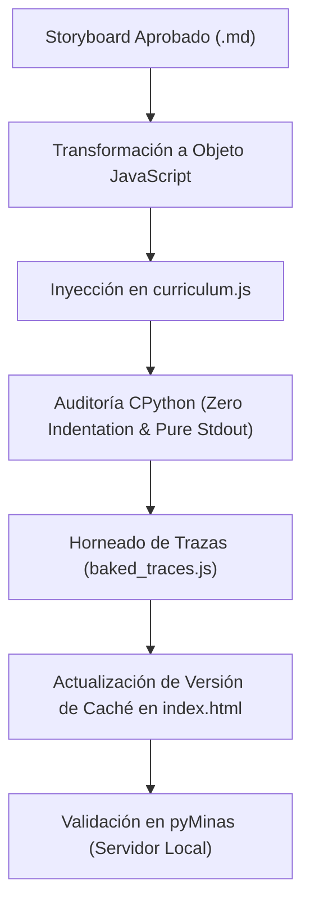

# Habilidad: Programar Currículo en pyMinas (Fase 2)

Usa esta habilidad **ÚNICAMENTE después de que el usuario haya aprobado explícitamente el storyboard** (`borrador_semana_<NUMERO>.md`).

> [!CAUTION]
> **REQUISITO PREVIO OBLIGATORIO:**
> Si el usuario no ha aprobado el borrador pedagógico en Markdown, NO ejecutes esta habilidad. Remítelo primero a la habilidad `disenar-semana-storyboard`.

---

## Flujo de Trabajo Técnico (Fase 2)



---

## 1. Estructura de Datos en `curriculum.js`

Inserta la nueva semana en el arreglo `CURRICULUM.weeks` respetando la convención de IDs:

```javascript
{
  "id": "semana-3",
  "number": 3,
  "title": "Semana 3: Ciclos y Repetición",
  "description": "Automatización de tareas repetitivas con while, acumuladores y centinelas.",
  "status": "active", // o "locked" según el progreso
  "lessons": [
    {
      "id": "w3-l1",
      "weekId": "semana-3",
      "number": 1,
      "tag": "Ciclos",
      "shortTitle": "El Ciclo While",
      "title": "¿Cómo repetir instrucciones con while?",
      "description": "Condición de parada, variables de control y bucles infinitos.",
      "duration": "8 min",
      "steps": [
        // Pasos: explanation, predict, code_sandbox
      ]
    }
  ]
}
```

---

## 2. Esquemas de Cada Tipo de Paso

### A. Paso Explicación (`explanation`)
```javascript
{
  "type": "explanation",
  "partLabel": "Paso 1 · El concepto",
  "title": "La condición de repetición",
  "intro": "Un ciclo while evalúa una condición booleana antes de cada iteración. Si es True, ejecuta el bloque.",
  "examples": [
    {
      "label": "Contador ascendente",
      "code": "contador = 1\nwhile contador <= 3:\n    print(f\"Paso: {contador}\")\n    contador += 1",
      "output": "Paso: 1\nPaso: 2\nPaso: 3",
      "explanation": "El ciclo se detiene en cuanto contador vale 4, haciendo la condición False."
    }
  ],
  "keyTakeaway": "Si olvidas incrementar la variable de control, el ciclo se ejecutará infinitamente."
}
```

### B. Paso Predicción / Trazado Mental (`predict`)
```javascript
{
  "type": "predict",
  "partLabel": "Paso 2 · Trazado mental",
  "title": "¿Cuántas veces se ejecuta?",
  "code": "n = 5\nwhile n > 2:\n    n -= 1\nprint(n)",
  "question": "¿Qué número imprimirá Python al finalizar el ciclo?",
  "theory": "Rastrea mentalmente el valor de 'n' en cada ciclo: 5 -> 4 -> 3 -> 2.",
  "options": [
    {
      "id": "A",
      "text": "3",
      "isCorrect": false,
      "whyIncorrect": "Cuando n llega a 3, 3 > 2 sigue siendo True, por lo que entra al ciclo y se resta a 2."
    },
    {
      "id": "B",
      "text": "2",
      "isCorrect": true
    },
    {
      "id": "C",
      "text": "1",
      "isCorrect": false,
      "whyIncorrect": "Cuando n vale 2, la condición 2 > 2 es False y el ciclo termina inmediatamente."
    },
    {
      "id": "D",
      "text": "5",
      "isCorrect": false,
      "whyIncorrect": "El ciclo se ejecuta al menos una vez porque 5 > 2 es True, mutando el valor inicial."
    }
  ]
}
```

### C. Paso Práctica Guiada (`code_sandbox`)
```javascript
{
  "type": "code_sandbox",
  "partLabel": "Paso 4 · Práctica guiada",
  "title": "Detén el ciclo a tiempo",
  "instruction": "Selecciona la condición correcta para que el mensaje se imprima exactamente 4 veces:",
  "code": "vueltas = 0\nwhile ___:\n    print(\"Vuelta completada\")\n    vueltas += 1",
  "expectedOutput": "Vuelta completada\nVuelta completada\nVuelta completada\nVuelta completada",
  "options": [
    {
      "id": "A",
      "text": "vueltas == 4",
      "isCorrect": false,
      "whyIncorrect": "Al inicio vueltas es 0, así que 0 == 4 es False y el bucle nunca se ejecutaría."
    },
    {
      "id": "B",
      "text": "vueltas < 4",
      "isCorrect": true
    },
    {
      "id": "C",
      "text": "vueltas <= 4",
      "isCorrect": false,
      "whyIncorrect": "Con '<=', se ejecutaría para 0, 1, 2, 3 y 4 (un total de 5 veces en vez de 4)."
    },
    {
      "id": "D",
      "text": "vueltas > 4",
      "isCorrect": false,
      "whyIncorrect": "0 > 4 es False desde la primera evaluación; el bucle no daría ninguna vuelta."
    }
  ]
}
```

---

## 3. Reglas Técnicas Críticas al Escribir Código

1. **Dedent Estricto:**
   - La primera línea de código no debe tener espacios.
   - Las líneas interiores deben usar exactamente 4 espacios por nivel de indentación.
   - Si se escribe con caracteres de escape, los saltos de línea deben ser `\n` limpios.

2. **Verificación de Sintaxis y Salida con CPython Real:**
   - Ejecuta un script de verificación (usando `python3 -c ...`) para cada snippet insertado.
   - Asegúrate de que `output` o `expectedOutput` coincida exactamente con la salida de `sys.stdout` de Python.

3. **Horneado de Trazas (`bake_curriculum.py` / `baked_traces.js`):**
   - Ejecuta el generador de trazas pre-calculadas:
     ```bash
     python3 bake_curriculum.py
     ```
   - Esto genera la ejecución línea por línea para que el reproductor de Brilliant funcione a 60 FPS sin latencia.

4. **Bumping de Versión en `index.html`:**
   - Incrementa el parámetro de versión de los assets para evitar problemas de caché en el navegador del usuario:
     ```html
     <script src="curriculum.js?v=1.39"></script>
     <script src="baked_traces.js?v=1.39"></script>
     ```

---

## 4. Lista de Chequeo Final
Antes de dar por terminada la programación:
- [ ] `curriculum.js` es un JavaScript válido sin errores de sintaxis (`node -c curriculum.js` o parsing con python).
- [ ] Todas las opciones correctas están balanceadas (~25% cada una).
- [ ] Todas las opciones incorrectas tienen `whyIncorrect` sustancioso.
- [ ] No hay advertencias de `IndentationError` en los snippets.
- [ ] El servidor local corre y muestra la nueva semana en el mapa de progreso.
